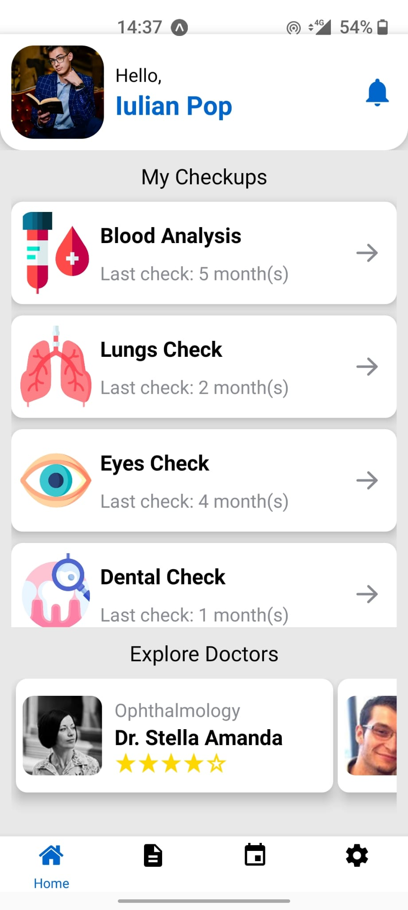
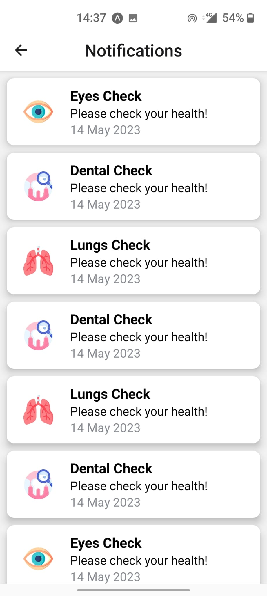
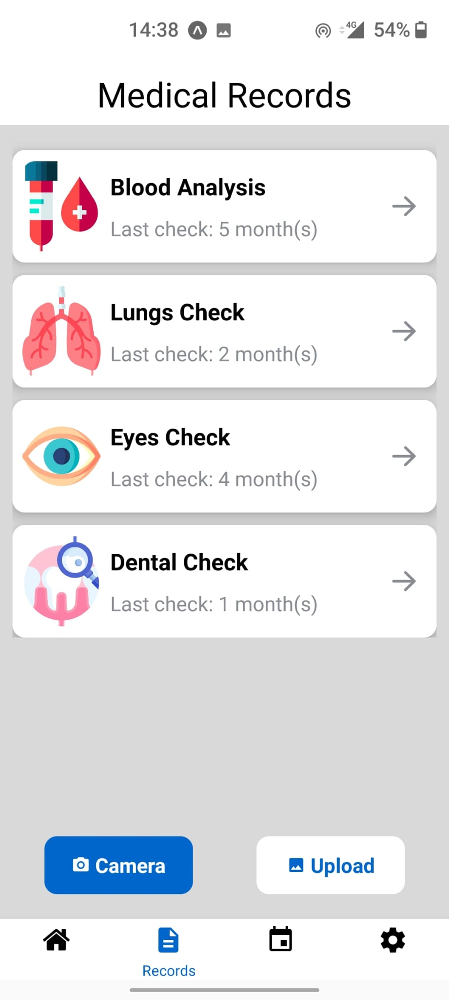
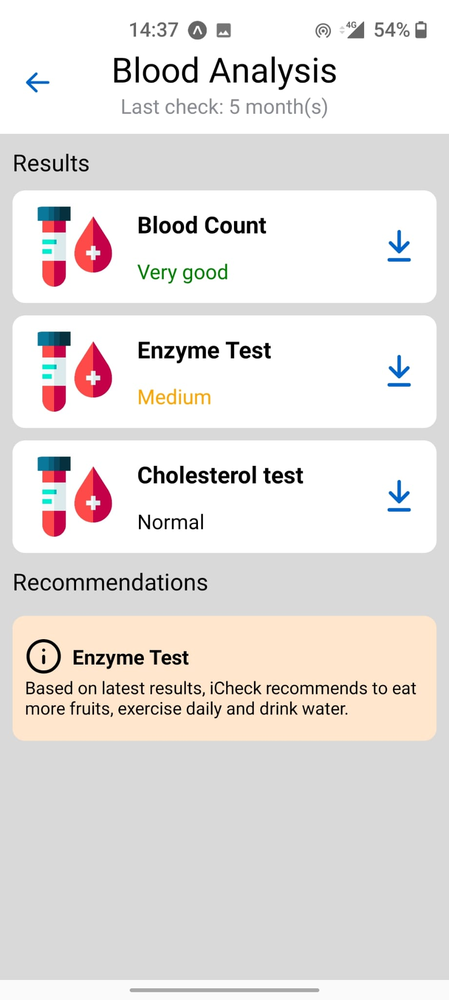
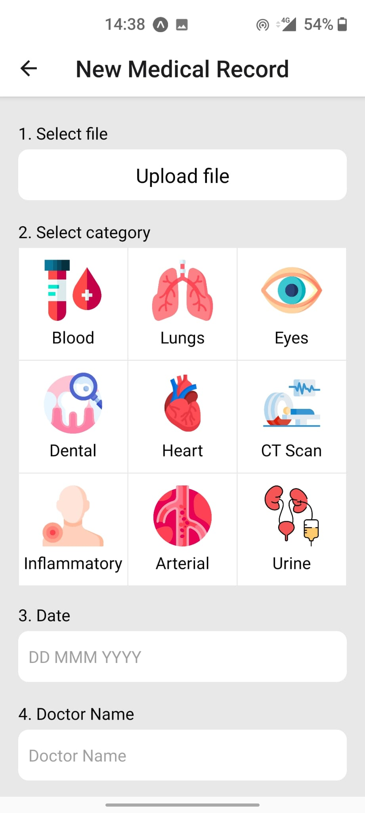
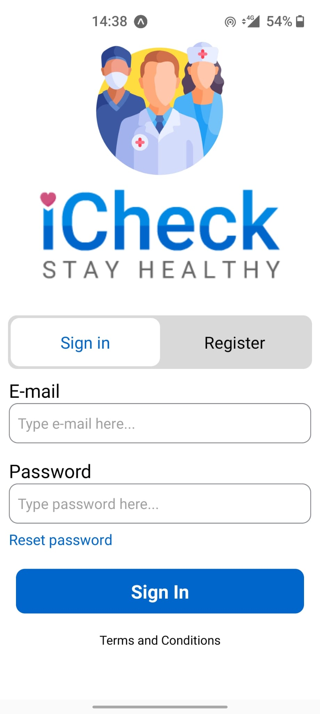
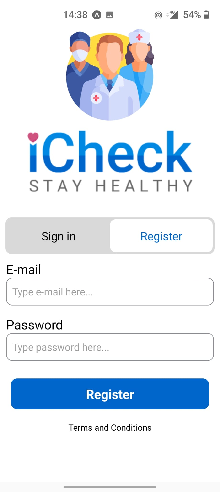

# iCheck

Are you ready for a health checkup? Improve your life by checking all your cells. Upload & view medical records and receive notifications when is the time for a new health investigation.

## Home and Notifications

  
  

The user can see his data and explore for good reated doctors. Also, he can access the notification center where he sees all his data sent from the app.

## It's all about the records (for now)

  
  
  

The user uploads a document regarding his medical control and by selecting one of the categories listed the app will now when to send a new notification. In the future we consider implementing an OCR reader to simplify the life of the user.

## Signin and Signup

  
  

The application is conncted via Firebase.

### Team members:

- Lucian Mangu: UI/UX designer
- Pop Iulian: React Native Developer
- Poenaru Iulian: React Native Developer
